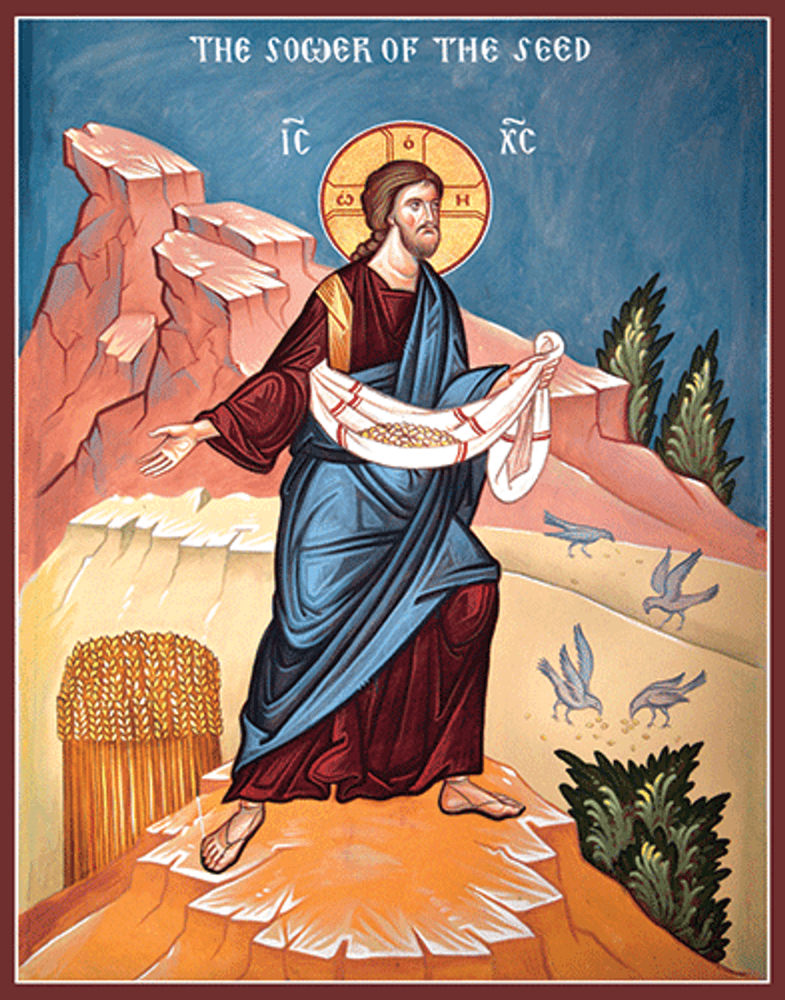

> The thorns that choke the seed came from seeds themselves.

The rebuking of heresies from the ancient Church was in a way a manifestation of the wisdom of the Church Fathers. After God became flesh and dwelled among us, after Christ’s ministry and triumph over death, the early Christian communities were plagued by confusion arising from what we now conceive as misguided ideas of God’s nature and right worship. God’s grace elevated our ancient Fathers and kept them steady in their path to enlighten Christian understanding and dispel some of these deviant ideas.

The grace manifested by Church Fathers and Ecumenical Councils have acted as a defence against heresies; yes, they have also brought schism (which is worth meditating about at some other time), but an insight can be drawn from one of such early heresies which has been universally condemned by Christianity. Saint Polycarp and Saint Ignatius of Antioch’s letters played a seminal role in dispelling Gnosticism, which among other things presented the material creation as a flawed product from a lesser, evil deity from the God of Abraham and Jacob. The idea grabbed a hold of proto-Christians and spread under its own tenets, as a promise for some ‘secret knowledge’ that brought salvation, changing and surviving well into the medieval period in communities such as the Cathars. While the long intellectual and spiritual battle that challenged Gnosticism is part of the history of the Church, it is much harder to discern what created the flammable spiritual landscape that resulted in such a fire to burn for such a long time. Ignited kindle were likely commonplace amongst early Christians, but something about this spark turned it into a fire which was only quenched by the works of thinkers and Saints.

That which comes from the wilderness can sometimes stumble across the fertile ground and spread because of it. In the darkest of times, it can even smother other seeds of truth. In Matthew’s gospel, Jesus presents the parable of the Sower and talks about the seeds of His Word falling on thorny soil and being choked to whither and die, later explained to mean that the Word of God bears no fruit when stifled by looming mundanities and worldly worries. I have to remind myself that these thorns also come from seeds, and they can only grow into thorns by feeding off the same ground that ought to nurture the true Seed. It is good to be watchful of the unknown seeds coming from the wild, lest they grow into thorns.

As with the ancient church, modern Christian thought is in constant tension because of ideas, big and small, that challenge our interpretation of orthodoxy. They are perhaps not only a rejection of truths handed down by revelation and tradition, but rather agents in of themselves. Not all misguided biblical interpretations and imaginings of ill-perceived truths turn into heresies, but it not might be easy to recognise the ones that will early on - not with our limited human understanding.

At a grander scale, the contrast between Christ’s teachings and the current spirit of the times have given way to one of the most tense spiritual battlefields of recent times: “modernising the Church”. Detractors are as passionate of this notion as their supporters, which count amongst their ranks a diverse range of the faithful, from parishioners to priests and pastors, even going as high as bishops. Consensus on this issue is, for now, elusive; this is why the underlying nature and perhaps even agency of these challenges to orthodoxy may be significant in discerning their intent - yes, I talk about ‘intent’ as if ideas such as modernising the Church had agency, which they just might. If not the ideas themselves, then perhaps their nature and the means by which they reach our hearts and minds.

Far from the deeper theological debates of past and present (which I’m hardly qualified to weigh in on), many ideas of modernising Christianity in reality follow far more shallow arguments; they feel as a clamour for ‘catching up with the times’, ‘reflecting the world we live in today’ and 'becoming more attractive to [younger] people’.

Have these ideas been at the core of some past challenges to orthodoxy and heresies? And do they appear as seeds which we will allow to grow fully? When the seed is unknown, it is challenging to tell if they will produce a garden or an undergrowth.
