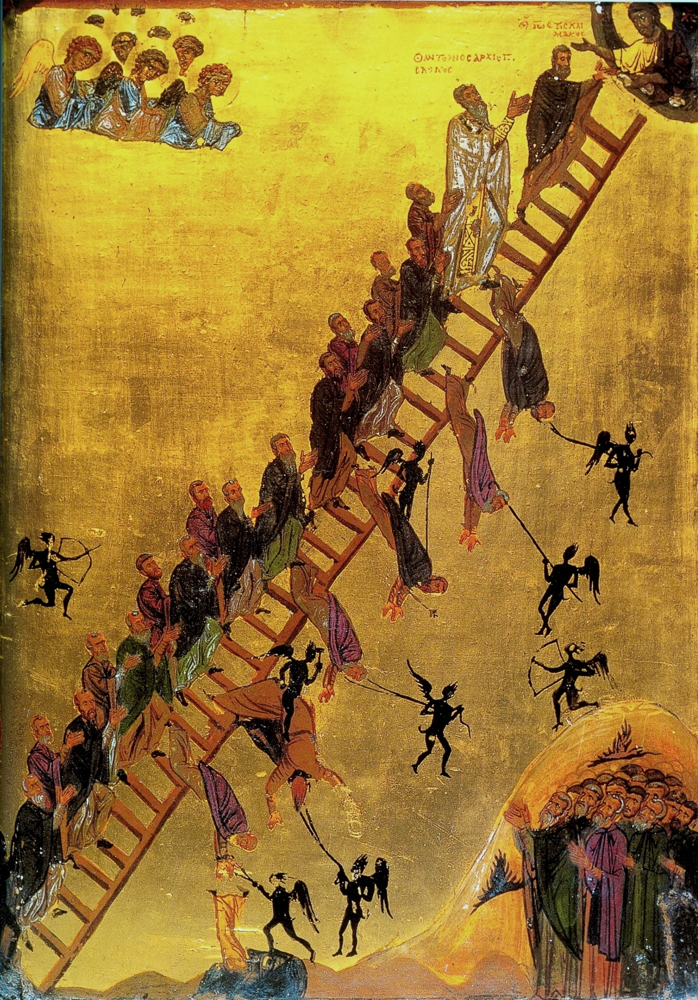

> Our attention and worship is so frequently demanded by lesser entities, and some of these are already deeply embedded within the broader spirit of the age.

I often think about ideas proposed or discoveries made by humans, and how these can point towards something much more profound than what is first interpreted. This notion somehow relates to this From the wilderness experiment, as I try to find a deeper meaning for the very constrained corner of the material world which I study: how infectious diseases transmit. Along those lines, I also think that the concept of the zeitgeist, the “spirit of the age”, might indeed be how philosophers like Hegel chose to interpret a facet of reality which is more far-reaching than they initially claimed.

The Hegelian notion of zeitgeist originally considered the historical domain of state-building (contrasted by the spirit of the world and the spirit of the nation) but has now expanded to refer to everything from fads and fashions to trendy and widely accepted intellectual arguments and points of view. Even under this context, it is intriguing to think how such a force takes over the majority (or sometimes entirety) of the people living in a particular time and place.

Because we live in an age of social media, it is now more evident than ever that something like the spirit of the age can indeed mutate and adapt with time and slowly (or in some cases very swiftly) spread amongst the people. For instance, there is a plethora of small ideas and sentiments that float around the vast network of human interactions that is the internet, and while some of these ideas rise and fall unceremoniously (unnoticed even), those ideas that linger may slowly build up into greater movements, taking an agency of their own. I like Jonathan Pageau’s reflections about these modern trends and how they compete for our attention, which should be aimed to the Highest if things were in proper order, but instead drift away into the ever-growing zeitgeist. In a way, I see the small “infectious” ideas acting in synergy to construct an ever more efficient attention-devouring agency.

I can’t quite figure out at which stage these numerous viral ideas or notions forge an overarching spirit that demands so much of the inhabitants of its age. It might even be that there is no single zeitgeist, but rather a multiplicity of lesser spirits demanding our attention and enacting their intent in the form of ‘viral ideas’, and that their synergy is attributable to other external forces altogether. Whatever the case may be, the totality of the zeitgeist can be palpable. As an epidemic is composed by thousands of individual moments of contagion over time which form a wave-like phenomenon when observed from a distance, so do the thousands of small ideas that make up the spirit of the age move like a wave. With epidemics as with the zeitgeist, the hard part is to work out the gravitational pull that guides the motions of this tide.

The more distressing aspect of a zeitgeist goes beyond its presence or existence, but rather its influence and how it draws people. Especially in the modern world it’s hard to escape the perceived need to comply with the current acceptable stances on numerous topics, lest one gets labelled as anything from a retrograde to a social menace. But this call to compliance might in fact be born from the zeitgeist’s demand for our attention, ever-focused upon the latest worldly musings and ever-distant from the transcendent. Identifying a foe is the first necessary step to facing and defeating it, and I put forth that the zeitgeist can be seen as a foe, or at least as part of one. Not every aspect of a zeitgeist is predatory, but a good rule of thumb is to pay attention to which aspects of it demand our attention in an ever more gluttonous manner. Perhaps the true demon is not the lingering spirit of the age, but it certainly cooperates with and is wielded by other agents which demand our attention, our worship.

At home, my wife and I try to be very deliberate about a particular way in we interact with our son. We try not to say “be careful” whenever he approaches a situation where he might hurt himself or break something by accident, but instead tell him (while of course being watchful of his actions) to “pay attention”. The world is full of things that pose a danger and where we need to ‘be careful’, but the way in which we do it is by actively and voluntarily observing and noting things so we may act accordingly. Besides, navigating this world where the very spirit of the age you live in can be such an absorbing force requires just that: start by paying close attention.
