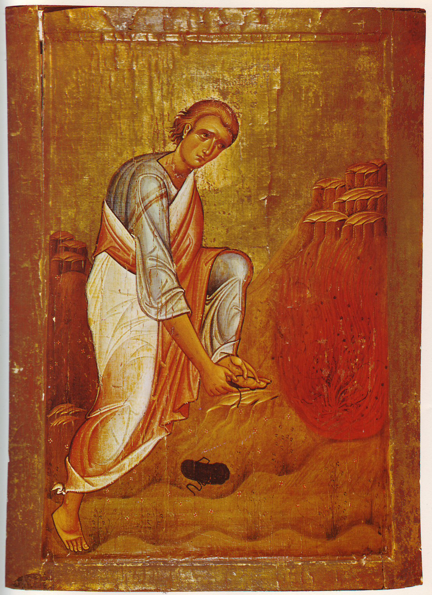

> God often speaks to us through the language of beauty, yet our feeble minds can be so easily drawn by that which is shiny yet ugly.

On a recent event featuring Jordan B. Peterson, Bishop Robert Barron and Father Mike Schmidt and touching on the topic of beauty, Peterson made a remark which quite intrigued me: "Beauty is a burning bush", referring to something that draws our attention first and from where God can speak to us. I've been pondering on how attention stealing agents act and can quite literally spread across our social fabric, which is the opposite of Peterson's statement. It is in fact sobering to the speaker's discuss in such a positive light the face of a divine phenomenon by which God calls our attention towards Him. It's a reminder that our capacity for attention is a divine gift itself, which should be set apart willingly and directed to the Highest.

Why do we look away from the burning bush then? How is it that transcendent beauty can be so easily overthrown by cheap, quick flashes of light or by sterile and uninspiring aesthetics? Some of these answers are rooted deep in our psychology, they can be derived from milennia of evolutionary development which make us prone to placing our senses on events which might be meaningless in hindsight but, at the time of their occurrence, might have been real threats that demanded investigation. However, I don't think this provides a complete explanation: large swaths of modernity have revolved around the progressive development of means of capturing people's attention, not in exchange for soothing fears but rather for quick bursts of pleasure. It is Aldous Huxley's Brave New World rather than George Orwell's 1984. It is Neil Postman's Amusing Ourselves to Death. It is the economy and tyrannic attention capturing. It intrigues me that the objects that capture our attention can be so effective while being so untranscendent. Modern media is essentially where we find this more clearly, as ever shorter and more outlandish products conspire to capture our eyes and ears in intense barrages. I don't think it's controversial to say that media, from advertising to social netwrok apps, exploit the ay our brains are wired to maximally capture our time by firmly grasping our attention and not letting go. Television-based media capturing could steal our time for hours on end, but it was no match for modern social media which is literally constructed as a way to incentivise 'engagement' - and lots of it.

Our attention dwells within a temporal context, which is why these attention-capturing egregores operate in time. To continually drive our mind away from truth, they must act constantly and, if they are clever (and clever they are), they will try to make their task ever less burdensome and easier to accomplish. It is not enough for a shiny object to distract us from the transcendent for a second, it needs to retain our attention or to make us more prone to be distracted by the next meaningless shiny object. This is why, in a way, transcendent beauty is under attack. As universal and undeniable as it may be, we are lied to into discarding its meaning by having it replaced with filler. The burning bush is undeniably calling to us in many forms, but it is all to easy for these attention-seeking entities to scream louder and to, temporarily overcome the true calling of our Lord. The prophet Elijah came to this beautiful insight himself, by recognising that the thunderous storms and rumbling earthwaukes were not the voice of God, but rather the soft whisper of the breeze. Part of what the attention-seeking egregores have accomplished is to flood our modern lives with rumble and thunder, burying at times the signal with unbeleivable aounts of noise. Few of us even attempt to follow our forefathr Elijah in seeking the breeze, in finding the place where no storm nor earthwuake can quench the quietness of God's calling. Beauty is that, in a way. It's a whisper, which can be so undeniably perceived and so easily hidden away by distracting cacophonies that overburden our senses.

We humans cannot gaze at God directly, and beauty might be one of those veils between us and God's Glory. Directly interacting with God in its fullness in our uncleanliness and unholyness can in fact destroy us, which is why He has in the past dwelt among His people behind veils or withdrawn entirely for their sake. Beauty is not trivial, but rather a profound vessel which contains a path towards heaven. This is why liturgy, in its full form, can draw us so close to something which is not of this world and which feels so unambiguously divine. In beauty we can find answers to our instinctual craving for meaning, even when such answers are mostly unintelligible to our limited minds. We only catch glimpses of it. It almost feels like the world tricks us into believing that quick bursts of light offer a completeness that the mystery of beauty does not. Maybe as part of our fallen nature we cannot fathom that such profound meaning can be found in such subtle means. But as a start, it would be wise of us to remember that most things we perceive in a way call to us. What they draw us into is not hard to discern, but chosing what to give ourselves into is.