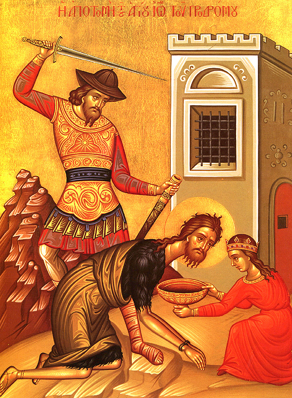

> Sin can be brought in by us from the wilderness. How do we use the wilderness then as a call to repentance when we risk bringing in this sin?

The ancient world, as depicted in the Old Testament, is violent. That much is undeniable, and sets the stage for some of the most challenging questions in our current understanding of Christian views on anthropology, ethics and conflict. These questions are truly timeless, as violence is an almost unavoidable facet of human civilisation. Warfare itself has been theorised as arising in unison with settled human societies, as the ability to produce and store food lended themselves as an incentive for peoples to raid the neighbours valuable resources for their own survival. Interesting, an ultimately utilitarian model for the emergence of warfare and violence amongst humans. It says nothing about human nature, it just asserts that a lack of some moral code drives the initiative to wage war with others. In some way, this can also functionally explain violent crime and depict it as a utilitarian mechanism to deal with resource scarcity in the absence (or inspite) of moral restrictions limiting such course of action.

Not long ago, a scientifically minded individual self identifying as a "researcher" posited an odd comparison. When referring to the tendency to commit violent crimes amongst people who were imprisoned for multiple occassions, this person asserted (and I paraphrase) that violence is "like a virus, spreading and evolving into more dangerous forms". On its face I am dunbfounded by the statement, but on a closer and perhaps more charitable read I would like to attempt to turn this superficially clumsy metaphor (which I still think was the original intent) into a more insightful statement by proposing a mechanism for this. I often propose the notion of the wilderness as a source for some of the sin we battle, and for this case it could become a useful way to approximate what prisons can be. In a civiliational sense, these spaces can truly be entirely upside down in how they operate: the intensity of protecting the individual integrity (as this is a means of genuine survival when inmate violence is guaranteed) leaves little room to place your attention on anything higher above. Worship stops being any focus of attention when your eyes have to be turned to your fellow men, who are doing the same. It seems to be a prime location where communion is unlikely to thrive spntaneously. But the intense individualism is also contratsed by extreme physical closeness between inmates. These conditions favour the thriving of violence setting the stage for this wilderness, but as I've written before, sin spreads where it can easily get a hold. We have the setting for sin to take over, now we need the sin itself: rage. Violent behaviours can be meticulous, cold and calculated, but are more often explosive and full of anger. The original statement can be read as: "prison is a wilderness set up to spread the sin of rage, and condemning men to an exile into this wilderness can easily out them in a place where they will be haunted by this sin, and more likely tha not, fall into its claws".

What about the change, the "mutation" of these virus into something else? Do people get exposed to an ever more gruesome form o the sin every time they are incarcerated, or is it that being challenged by the same temptations time and time again wears down a man and makes give into this evil, more fundamental in nature but more noticeable as a soul gives into it unrepentant? From the "data science" angle of the original post, I think these questions suffer from the probem of untractability: any proposed models cannot define which of these explanations is more likely to explain the data. In fact, the problem with the original post is that the data and the analysis don't even begin to address these questions nor the original proposal of the person writing the post that more severe penalties should be in place to ensure that individuals do not return from their exile bringing with them such violence. This is, I believe, most uncharitable. By turning the problem of violence into numbers, the original proposal turns souls into nothing more than vectors, harbingers of calamity rather than people with the complete capacity and divine mandate for repentance.

These problems are in fact biblical in their nature and timescale. The entirety of the atonement rituals amongst the people of Israel found ways for people who were unclean to become purified before rejoining their community, or to be separated from the community until a time for repentance came, if it ver did. The Church of Christ adopts this notion as well, and can correct and guide by the purification of Confession or by the separation of members from its body through Excommunication, which can and should be restored following repentance. Denying this repentance, which can take the form of (or transform into) physical or spiritual death, is contrary to God's mercy. It does not mean that God will infinitely extend this mercy for everyone, but the lengths to which it will go are beyond our understanding. The central role for atonement is to protect the commuunity as well as to call the sinner to repentance. In this way our actions of incarceration as a form of exile are in line with Christian teaching and understanding, but our approach ato inviting those in exile to repentance are most definitely not. It usually takes, poetically, some ministries to literally venture out into this wilderness to reach out to those in exile and call them to repentance. During a recent paschal event for teenagers I heard the testimony of a young man who was part of the organisation whose family had embraced the Lord's call following a conversion experience by his grandfather while he was in prison. His was not a crime of violence, but his repentance came by the mouth of another Christian calling him back.

The wilderness is troubling as it can be such a source for sin. This calls us to avoid letting our communities from turining into ever wilder and more upside down spaces, especially because letting this occur can also create more space for sin to thrive. It takes far more prayerful meditation to define how we create and manage these wildernesses we create as a means to attempt to establish justice, flawed human justice.